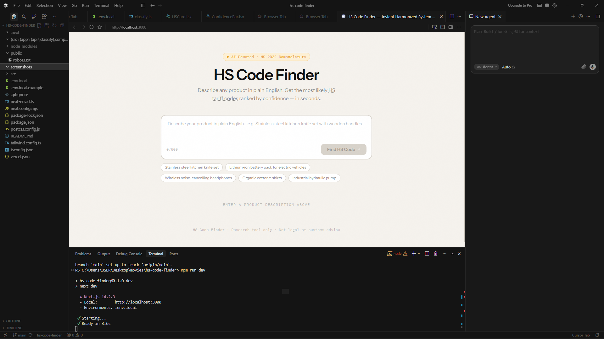
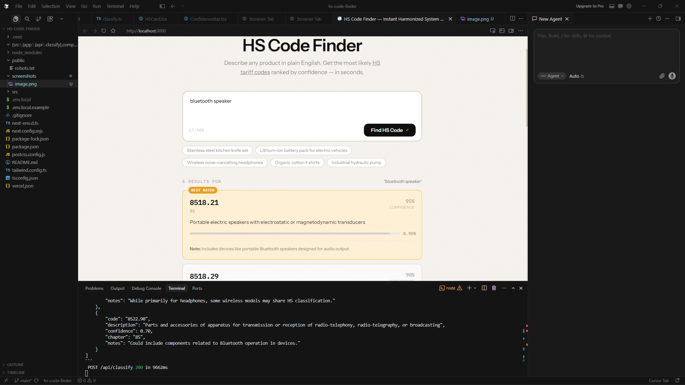

# HS Code Finder
# HS Code Finder

🚀 Live Demo:
https://ai-hs-code-finder.vercel.app

AI-powered HS Code Finder that converts natural language product descriptions into ranked Harmonized System (HS) tariff code suggestions with confidence scoring.

## Features

- Natural language product classification
- AI-generated HS code suggestions
- Confidence scoring
- Multiple ranked results
- Fast Next.js interface
- Responsive design
- OpenAI-powered classification engine

## Screenshot

### Homepage



### Search Results



## Tech Stack

- Next.js 14
- TypeScript
- TailwindCSS
- OpenAI GPT-4o-mini
- Vercel Edge Runtime

## Installation

```bash
npm install
npm run dev
```

Open:

http://localhost:3000

## Environment Variables

Create:

.env.local

```env
OPENAI_API_KEY=your_api_key_here
```

## Use Cases

- Import/export businesses
- Customs research
- Logistics teams
- Product classification workflows
- Trade compliance research

## Disclaimer

This project is intended for research and educational purposes only. Results should not be considered legal, customs, or compliance advice.

## License

Copyright © 2026 Jiswin Tom Jose.
All rights reserved.